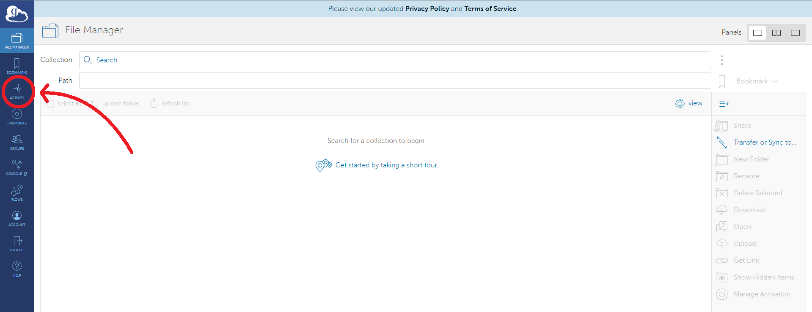
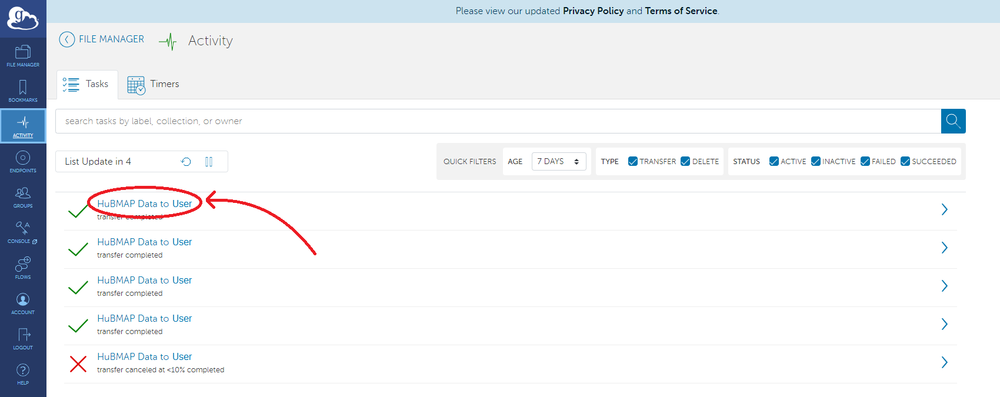

### Using the HuBMAP CLT


The HuBMAP Command Line Transfer utility provides the functionality to download HuBMAP data of individual files and directories across multiple datasets at one time by specifying all downloaded data files and directories in a single manifest file.

This document covers usage of the HuBMAP CLT. Detailed instructions for installing hubmap-clt as well as other first 
time setup can be found [here](install-hubmap-clt.html). A [tutorial](view-globus-download-location.html) on how to view the current GCP download directory is also available.

usage: hubmap-clt [-h &#124; --help &#124; -v &#124; --version] [transfer manifest-file &#124; login &#124; logout &#124; whoami]

Commands: One of the following commands is required:

   transfer manifest-file   Transfer files specified in manifest-file (see
                            below for example) using Globus Transfer.
			                The transfered files will be stored in the
			                directory "hubmap-download" under the user's
			                home directory.

   login                    Login to Globus

   logout 		            Logout of Globus

   whoami                   Displays the information of the user who is
                            currently logged in.  If no user is logged
                            a message will be displayed prompting the user
			                to log in.

-h or --help  Show this help message.

-d or --destination	Manually select a download location within the user's
                        home direcotry. For example:
                          'hubmap-clt transfer manifest-file -d Desktop'
            			will download to the user's Desktop directory. The 
			            directory will be created under the user home directory
			            if it doesn't already exist.

-v or --version        Displays the version of the currently installed 
                       hubmap-sdk package


#### Manifest Files

A manifest file is required for usage of the hubmab-clt. This simple text file will contain the dataset id and the path
to the dataset separated by a space, one line for each file or directory to download. for example:

```
HBM123.ABCD.456 /metadata.tsv   #download the metadata.tsv file for dataset HBM123.ABCD.456
HBM345.ABCD.456 /               #download all files in the dataset HBM345.ABCD.456
HBM378.HDGT.837 /extras         #download the extras directory from dataset HBM378.HDGT.837
```
See below for more examples of [manifest files](#manfiles).

#### Login

A one-time login is required for any download session.  For any non-public data, you must login with your HuBMAP authorized account, for publicly available data you can log in with any account accepted on the login form (Google and OrCID accepted) as well.  To login issue the following command on the command line:

```
hubmap-clt login
```

Similarly, log out with the command:

```
hubmap-clt logout
```

To check the identity of the currently logged in user, enter the command:

```
hubmap-clt whoami
```

#### Example of usage

Having prepared or downloaded a manifest.txt file, logged in and having verified that the local GCP endpoint is running (see [below](#gcp)), the hubma-clt can be used with the following command:

```bash
hubmap-clt transfer manifest.txt
```

where manifest.txt is the file containing the resources to be downloaded and their locations. Depending on where the 
manifest file is located, the path to the file may be necessary along with the filename in the argument. For example:

```bash
hubmap-clt transfer ~/Documents/manifest.txt 
```

The files/directories will be transferred to the directory hubmap-downloads by default. This directory will be created under the local user directory if it does not yet exist. You can specify an alternative directory or subdirectory instead to download the data to with --destination or -d. Like:

```bash
hubmap-clt transfer manifest.txt --destination data/hubmap/rna-seq
```

Similarly, if you give the path/name to a directory that doesn't exist, it will be created. Be mindful of typos.

<a name="gcp"></a>

#### Note about Globus Connect Personal

In order to transfer data to the local machine, the **_Globus Connect Personal (GCP)_** endpoint must be up and running. Refer
to the installation guide if this has not yet been set up. The `hubmap-clt transfer` command will alert you if an instance of GCP is not running.  Please see the documentation at Globus to intall or run it [here](https://www.globus.org/globus-connect-personal)

<a name="manfiles"></a>

#### Manifest File Examples

Download the cell by gene matrix for multiple single nuclei RNA sequencing datasets:
```
HBM744.FNLN.846 /expr.h5ad
HBM658.VPJK.669 /expr.h5ad
HBM592.RPKF.946 /expr.h5ad
HBM363.TBHH.346 /expr.h5ad
HBM322.XJQZ.894 /expr.h5ad
HBM749.MTJC.865 /expr.h5ad
HBM722.TVXP.469 /expr.h5ad
HBM223.JQLM.452 /expr.h5ad
HBM524.KHPH.599 /expr.h5ad
```

The second item in each line (the specific path to a given resource) may contain spaces. If you are given the path to a directory rather than a file, be sure to prepend it with a trailing slash. For example:

```
HBM744.FNLN.846 "fastqc_output/"
```

If the path provided is for a directory, but there is no trailing slash, Globus will be unable to download the contents of the directory. A directory will still be created, but it will be blank.

#### Checking the Status of a Transfer

Once the transfer has been started successfully, the user will receive a success message that looks like this: 

```
Message: The transfer has been accepted and a task has been created and queued for execution
Task ID: 1234abcd-56ef-78gh-90ij-123456klmnop
```

At which point the transfer will be handled completely through Globus. To see the status of a transfer, whether it succeeded or failed, a progress bar, and other details about the transfer, 
a user must visit [https://app.globus.org](https://app.globus.org/file-manager). The user will be prompted to sign into Globus just as they were when logging 
into globus through the hubmap-clt. Once logged in, the user will be brought to the file manager page. Click the activity tab on the left to view all past and active transfers.



Here, users will see a list of past and present transfers. Clicking on one will provide more information about when the transfer started, the location of the data transferred, and much more information. 




For a complete break down of how to use the globus web app, please consult the [globus documentation](https://docs.globus.org/how-to/get-started/)
