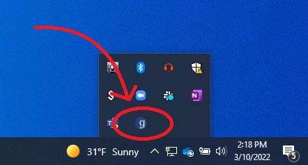
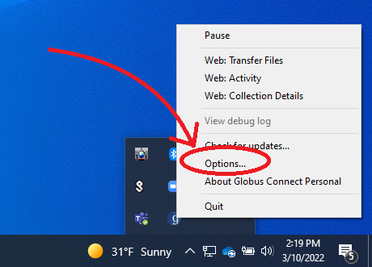
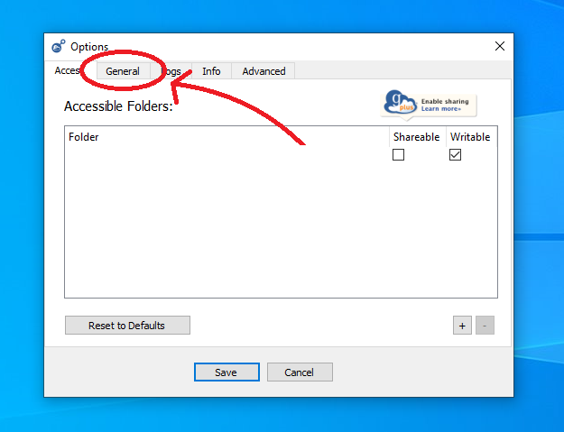
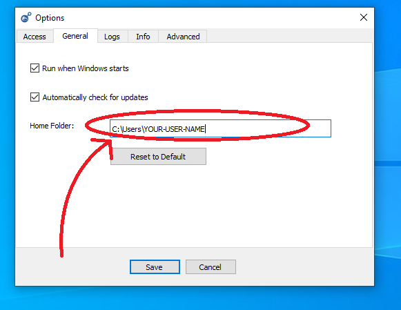
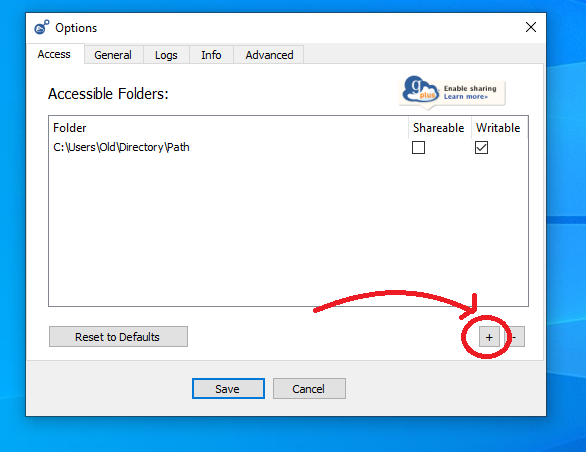
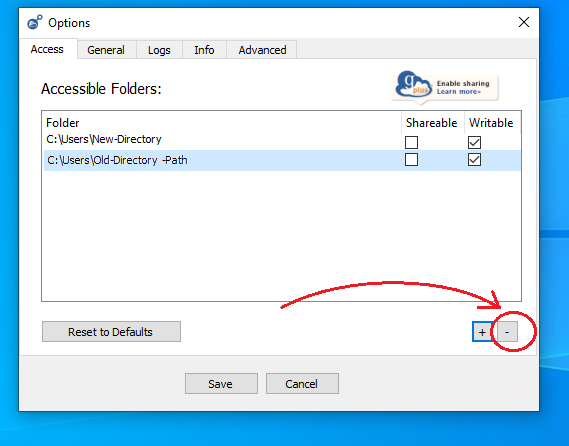

### Installing and Getting Started with the HuBMAP Command Line Transfer

The HuBMAP Command Line Transfer utility provides the functionality to download HuBMAP data of individual files and directories across multiple datasets/uploads at one time by specifying all downloaded data files and directories in a single manifest file.

This document covers installation of the HuBMAP CLT along with the Globus Connect Personal endpoint which is required to download data from HuBMAP.


#### Globus Prerequisites 

In order to download any content from Globus, users must install **_Globus Connect Personal_** on their device. This 
creates a globus "Endpoint" locally. Downloads take the form of transfers from the desired Collection to the endpoint 
created on the local machine. Instructions on installing **_Globus Connect Personal_** can be found <a href="https://www.globus.org/globus-connect-personal">Here</a>

During setup, users will have the opportunity to name their Endpoint and login with their Globus Credentials

#### **_IMPORTANT NOTE ABOUT GLOBUS CONNECT PERSONAL_**

While GCP on linux chooses your home directory as the download location by default, if you are using windows, it is likely that the default download location will not be your home directory. This must be changed or you will experience some difficulty
finding your downloaded files. To change the download directory on windows 10/11, find the GCP icon in the system tray. If the "g" logo is neither on the right side of the task bar, nor in the hidden icons menu, GCP may not be running; in this case you must launch GCP before chaning any settings.



Right-click on the GCP icon to see the context menu. This menu will contain an options button



Inside the options menu, navigate to the General Tab



Next, inside the text box labeled "Home Folder", change this to be your home directory as shown below. Replace "Your-User-Name" to be the name associated with your home directory



Now we must navigate to the Access tab next to the General tab and give ourselves permission to use this new directory


Once here, press the plus sign in the bottom right corner to add a new authorized directory



You will be prompted to select a directory. Choose the same directory you chose to be your default directory. After adding the new authorized directory, we can remove the old one. Select the previous directory and press the minus button in the bottom right corner to remove it. Be sure to save after you're done 



Once this is all complete, all Globus files will be downloaded relative to this directory. 

#### Installing the HuBMAP CLT

The HuBMAP CLT is available as a Python package.
  - Python 3 is required to run the HuBMAP CLT, an installer for it can be downloaded [here](https://www.python.org/downloads/).
  - It is recommended that you create a new Python virtual environment first with `python3 -m venv /path/to/new/virtual/environment`, more information on Python virtual environments is available [here](https://docs.python.org/3/library/venv.html).
  - To install the HuBMAP CLT run the pip command shown below after installing Python and creating and activating a new Python virtual environment.

```bash
pip install hubmap-clt
```

This will also install other requirements needed by the the HuBMAP CLT including the Globus [Command Line Tool](https://docs.globus.org/cli/)

The globus command line tool is a separate tool from **_Globus Connect Personal_**. It is likely that users may have to
log in separately through **_Globus CLI_**. To see if a user is currently logged in, use the command:

```bash
hubmap-clt whoami
```

If a user is logged in, their username will be displayed. If not logged in, users will be prompted to login with the
following command: 

```bash
hubmap-clt login
```

The Globus login screen will open in the default web browser. Follow login instructions. 

#### Using the HuBMAP CLT

At this point, user should be setup and ready to use the Hubmap Command Line Transfer tool. Detailed instructions of 
its usage can be found [here](using-hubmap-clt.html).
