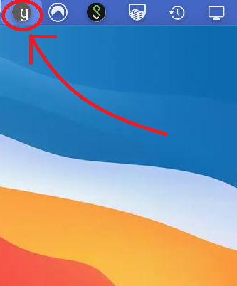
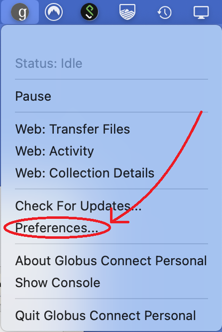
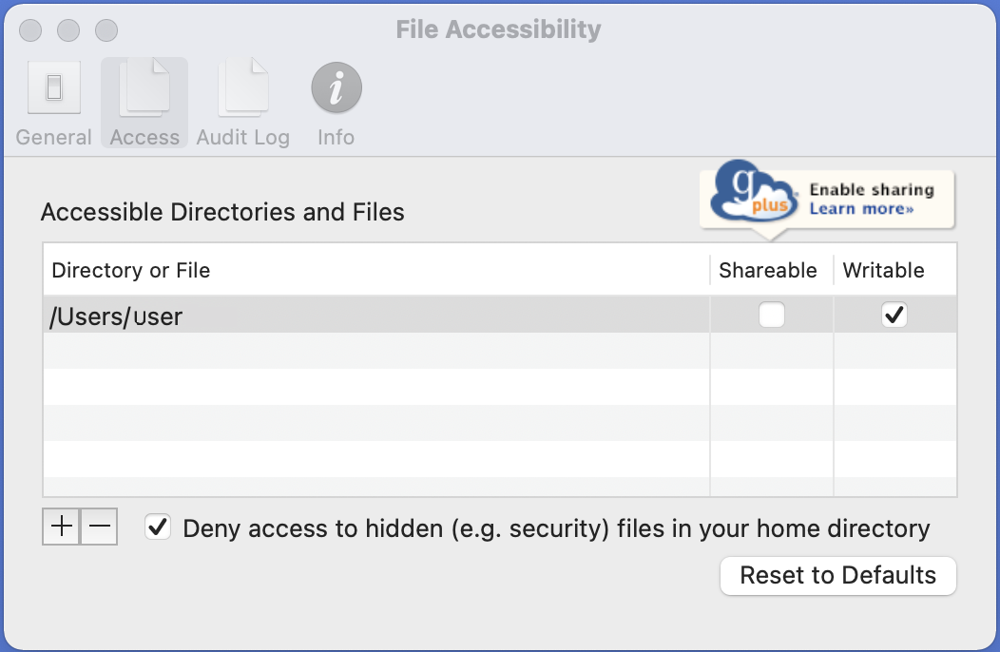
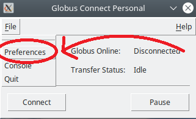

### Viewing The Current Globus Download Directory

All Globus downloads via the HuBMAP-CLT will be performed relative to the default Globus directory or "Home Folder".
This may not necessarily be your usual Home directory. On Windows for example, your current Documents directory is 
usually chosen by Globus as the Home Folder. This can be complicated further with One Drive. For example: if your Globus Home 
Folder is "User\OneDrive\Documents" and, using the HuBMAP-CLT \[--destination] option, you set your download location to be
"Desktop", you'll find your downloads have been placed in "User\OneDrive\Documents\Desktop" rather than your actual 
desktop directory.For this reason it is recommended that you change the Globus Home Folder following the instructions in [Using the HuBMAP CLT](using-hubmap-clt.html).

Whether or not you chose to change the default download directory used by Globus, it is useful to be able to find what
that directory is. This process will be slightly different if depending on your operating system. 

Windows Tutorial

If Globus Connect Personal is running, you should see its small icon either with the system icons on the far right end of the task bar, or located in the system tray. If you do not see its small icon, GCP may not be running. Launch the program by clicking the Globus Connect Personal App. The location for this app's shortcut may vary depending on how it was installed; typically it is found in the Start Menu directory under Programs. Searching "Globus Connect Personal" In the search bar is the quickest way to find it. For more information on installing and running GCP on Windows, refer to  <a href="https://docs.globus.org/faq/globus-connect-endpoints/">The GCP Docs</a>.

Right-click on this icon to view its context menu. Click the button labeled "options".

The options menu should open in the access tab. In this screen, you can  view the folders that are accessible by the GCP. Navigate to the general tab.

From this screen we can see the currently selected Home Folder. It is recommended to set this as your home directory.

Mac Tutorial

If Globus Connect Personal is running, you should see its small icon on at the top of your screen. If you do not see its small icon, GCP may not be running. Launch the program by clicking the Globus Connect Personal App. The location for this app's shortcut may vary depending on how it was installed. It should appear when searching "Globus Connect Personal". For more information on installing and running GCP on a Mac, refer to <a href="https://docs.globus.org/faq/globus-connect-endpoints/">The GCP Docs</a>.

Control click on this icon to view its context menu. Click the button labeled "preferences".

The preferences menu should open in the access tab. Navigate to general and you'll see the currently selected Home Folder

Linux Tutorial

Unlike Windows and Mac, Linux does not have a persistent taskbar icon. Typically, the Globus Connect Personal endpoint is launched manually from the command line. It is possible to launch GCP in the background and without a Graphical User Interface, however in this case we want to launch the GUI. Launch the GUI by running the following command in the terminal from whichever directory the GCP was initially installed:

<code>$ ./globusconnectpersonal-{version-number}/globusconnectpersonal</code>

Where {version-number} is the version of the GCP you are currently using. For example, for version 3.1.6, the command will be:

<code>$ ./globusconnectpersonal-3.1.6/globusconnectpersonal</code>

When the GCP GUI appears, click on the File button.

From the file drop-down menu, click Preferences.

Finally, you should arrive at the Access Path Configuration screen. Displayed inside the text-box will be the current GCP Home Folder. You can also conveniently change the Home Folder by modifying the value in the text-box if you wish.

